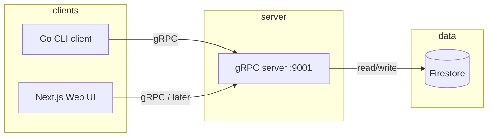
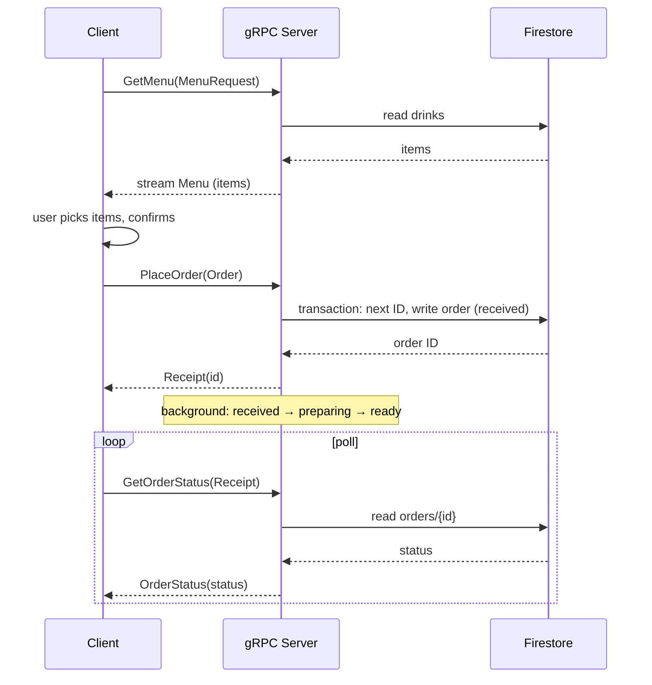

# gRPC Coffee Shop

Small coffee shop backend (gRPC + Firestore) with a CLI client and a web UI. Menu and orders live in Firestore; the server streams the menu and returns real order IDs and status.

---

## Architecture



- **CLI / Web** call the Coffee Shop gRPC API (GetMenu, PlaceOrder, GetOrderStatus).
- **gRPC server** (Go) talks to **Firestore** for menu (collection `drinks`) and orders (collection `orders`, counter in `counters/orders`).
- Local dev uses the **Firestore emulator**; set `FIRESTORE_EMULATOR_HOST` and `GOOGLE_CLOUD_PROJECT`.

---

## Order flow



1. **GetMenu** — server reads `drinks`, streams `Menu` (list of `Item`).
2. **PlaceOrder** — server gets next ID from `counters/orders`, writes one doc in `orders` with status `received`, then a goroutine moves it to `preparing` → `ready`.
3. **GetOrderStatus** — server reads `orders/{receipt.Id}` and returns `OrderStatus(status)`.

---

## Tech stack

| Layer      | Tech |
|-----------|------|
| API       | gRPC (Go), proto3 |
| Server    | Go, `google.golang.org/grpc`, `cloud.google.com/go/firestore` |
| DB        | Firestore (emulator or real project) |
| CLI client| Go, same gRPC client |
| Web UI    | Next.js 16, React 19, Tailwind; not yet wired to gRPC |

---

## Proto file (`proto/coffeeshop.proto`)

Defines the **CoffeeShop** service and messages.

**Service**

| RPC | Request | Response | Note |
|-----|---------|----------|------|
| GetMenu | MenuRequest (empty) | stream Menu | Stream of menu messages, each with repeated Item |
| MakeCoffee | CoffeeRequest (item_name, size) | Coffee | Single coffee; not used in current flow |
| PlaceOrder | Order (repeated Item) | Receipt | Returns receipt with unique id |
| GetOrderStatus | Receipt (id) | OrderStatus | Returns order_id and status string |

**Main messages**

- **MenuRequest** — empty; reserved for future filters (e.g. category).
- **Menu** — `repeated Item items`; streamed by GetMenu.
- **Item** — `id`, `name`, `description`, `price` (one drink).
- **Order** — `repeated Item items` (what the user is ordering).
- **Receipt** — `id` (e.g. "001", "002").
- **OrderStatus** — `order_id`, `status` (e.g. "received", "preparing", "ready").
- **CoffeeRequest / Coffee** — item_name, size, status; used by MakeCoffee.

Generate Go code from the proto with:

```bash
make proto
```

(Requires `protoc` and Go plugins `protoc-gen-go`, `protoc-gen-go-grpc`.)
