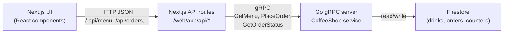

# Coffee Shop Web UI

Next.js UI for the Coffee Shop project.

## Architecture (short)

High level flow:



- The browser talks only to **Next.js API routes** (`/api/*`) via `fetch` and JSON.
- API routes work as a **BFF**: they call the Go `CoffeeShop` gRPC service.
- The Go service stores menu and orders in **Firestore** (emulator in local dev).\n*** End Patch`}/>

## Local development

In one terminal:

```bash
make emulators
```

Seed the menu once (or whenever you want to reset data):

```bash
make seed
```

Run the Go gRPC server:

```bash
make run-server
```

Run the UI:

```bash
make install-ui   # first time
make run-ui
```

Open `http://localhost:3000`.

## Environment

- **`GRPC_ADDR`**: gRPC server address for the Next.js BFF (default `localhost:9001`).
  - `make run-ui` sets it automatically.

## Future: true push “real-time” (optional)

Polling is the simplest first step. If you want the UI to receive status updates without polling:

- Add a gRPC server-streaming RPC like `WatchOrderStatus(Receipt) returns (stream OrderStatus)`.
- In Go, subscribe to Firestore document changes for `orders/{id}` and push updates into the stream.
- In Next.js, expose an SSE route (e.g. `/api/orders/:id/stream`) and proxy the stream to the browser.

